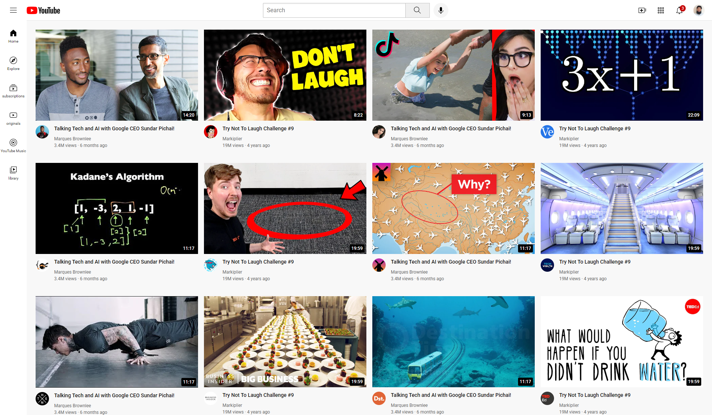

# 🎨 Responsive YouTube Home Page Design (Learning Project)

This project is a **YouTube-inspired homepage design** that I built while learning **HTML & CSS**.  
The main goal of this project was **practice and learning**, so it focuses only on the homepage layout.  
The design is **responsive** and works across devices (desktop, tablet, and mobile).  

---
## 📸 Screenshots



---

## ✨ What I Learned
- Structuring a homepage layout with **HTML5**.
- Creating a responsive design using **CSS (Flexbox/Row CSS)**.
- Improving CSS knowledge through practice.
- Understanding how to build a simple **wave-style layout**.
- Testing responsiveness without using JavaScript.

---

## 🚀 How to Run the Project Locally

1️⃣ **Clone the repository**
```bash
git clone https://github.com/ziaul-hoque4820/YouTube-Design.git
```
2️⃣ **Navigate into the folder:**
```bash
cd YouTube-Design
```
3️⃣ **Open the project:**
Simply open the index.html file in any browser.
- (No server setup or JavaScript required.)

---

## 🛠 Technologies Used:
- HTML5
- CSS3 (Flexbox/Row CSS)

### 🎯 Project Purpose
This project was built only for learning purposes.
It can be helpful for beginners who want to see how to create a responsive homepage design using only HTML & CSS.

## 👨‍💻 Author

**Ziaul Hoque Patwary**  
📧 Email: [**ziaul.dev@gmail.com**] 
🔗 GitHub: [ziaul-hoque4820](https://github.com/ziaul-hoque4820)